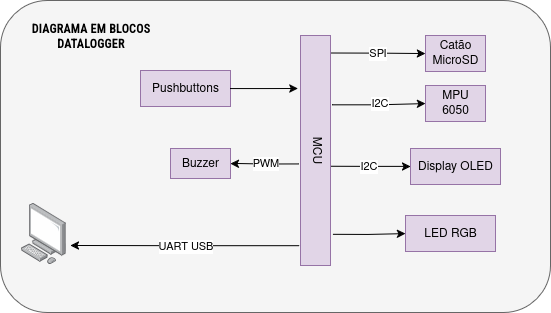
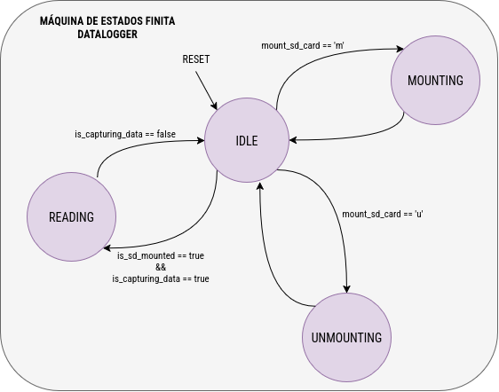

<h1>IMU Datalogger</h1>

<h3 align="center">Desenvolvimento de um sistema de sensoriamento e armazenamento de dados de aceleração e velocidade angular</h3>

    Este projeto consiste em um datalogger baseado em IMU (Unidade de Medida Inercial) capaz de coletar, processar e armazenar dados de aceleração linear e velocidade angular. O sistema foi desenvolvido para aplicações em monitoramento de movimento, permitindo a extração e análise dos dados registrados de forma eficiente.

## Sobre o projeto

A análise de movimento é fundamental para sistemas de navegação, 
controle de processos em tempo real, logística, robótica e 
diversas outras áreas de atuação. Neste contexto, o presente 
projeto visou o desenvolvimento de um sistema compacto para o 
sensoriamento e armazenamento dos dados de aceleração e velocidade 
angular experimentados por um corpo. O datalogger registra os 
dados coletados pelo módulo inercial MPU 6050 diretamente em um 
cartão MicroSD, no formato csv. O sistema conta ainda com um 
script, com interface via terminal, para a visualização gráfica 
dos valores coletados.

## ⚙️ Funcionalidades 

- Coleta de dados de aceleração linear e velocidade angular utilizando o sensor MPU 6050
- Armazenamento dos dados em cartão MicroSD no formato CSV
- Interface de visualização gráfica dos dados via terminal
- Operação autônoma e compacta para fácil integração em diferentes aplicações
- Facilidade de extração e análise dos dados registrados

    
<strong style="font-size:1.3em;">🛠️ Hardware utilizado</strong>

- Módulo MPU 6050 → interface I2C0
- LED RGB → GPIO 11, 12 e 13
- Display OLED → interface I2C1
- Pushbuttons → GPIO 5 e 6

    
<strong style="font-size:1.3em;">💡 Sinalização visual</strong>

- **Cor branca**: indica que o sistema está aguardando a montagem do cartão MicroSD;
- **Cor amarela**: indica que o sistema está realizando a montagem ou desmontagem do cartão MicroSD;
- **Cor verde**: indica que o cartão SD está montado e o sistema está aguardando a ativação da captura de dados ou desmontagem do cartão;
- **Cor vermelha**: indica que o sistema está realizando o sensoriamento e arquivamento contínuo dos dados;
- **Cor roxa**: indica um estado de erro seja no gerenciamento do cartão MicroSD (cartão ausente ou corrompido) ou do arquivo csv  (disco cheio ou erro na leitura);

<strong style="font-size:1.3em;">🔊 Sinalização sonora</strong>

- 2 bips curtos de 200 ms: inicio do processo de amostragem;
- 4 bips curtos de 200 ms: fim do processo de amostragem por solicitação do usuário;
- 1 bip longo de 700 ms: fim do processo de amostragem por erro

    
<strong style="font-size:1.3em;">📊 Diagrama de estados</strong>

